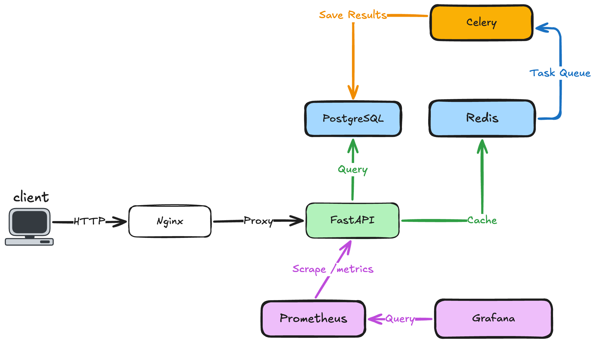
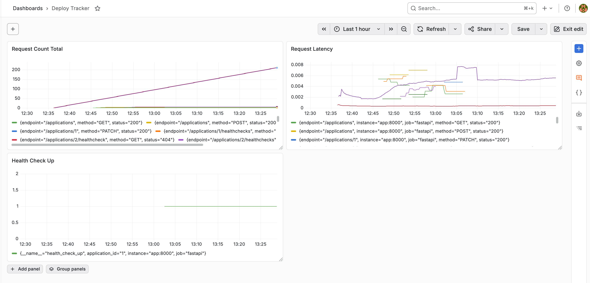

# Deploy Tracker
Deploy monitoring dashboard with observability.

An application that logs and monitors application deployments. Once an app is deployed, Deploy Tracker collects metrics, displays the status, shows logs, and triggers alerts if downtime occurs.

## Tech Stack
- FastAPI
- PostgreSQL
- Redis
- Celery
- Prometheus
- Grafana
- Docker Compose
- GitHub Actions
- Nginx

## Roadmap

- [x] Week 1: FastAPI + PostgreSQL (API core + database)
- [x] Week 2: Redis (caching layer)
- [x] Week 3: Celery/ARQ (async workers + health checks)
- [x] Week 4: Prometheus (metrics collection)
- [x] Week 5: Grafana (monitoring dashboards)
- [x] Week 6: GitHub Actions (CI/CD pipeline)
- [x] Week 7: Nginx (reverse proxy) + Docker Compose (full orchestration)
- [x] Week 8: README polish, tests, final refinements
- [ ] Week 9: Fixing the Gaps

## Why Week 9?

This project was originally marked as completed after Week 8. At that point, I had already built the API, database layer, cache, async worker, metrics, dashboard, CI pipeline, reverse proxy, and Docker Compose setup.

But during the final testing phase, I found a problem: the health check workflow was still tied to a hardcoded application id instead of monitoring all registered applications dynamically.

My first instinct was to move on.

I wanted to start the next project, keep building my portfolio, and get closer to my goal of becoming a DevOps / Platform Engineer before 25. But that ambition created a bad trade-off: I was about to leave behind a known flaw in a project that was supposed to document not only what worked, but also what failed.

Week 9 exists because of that.

**What I learned:** ambition is useful, but it needs discipline. Being focused and ambitious is not just about moving fast; it is also about knowing when to slow down and fix a known flaw.

Cool mind, warm heart.

## Architecture

## Monitoring Dashboard

## How to Run

### Prerequisites
- Docker
- Docker Compose

### Setup
1. Clone the repository  
`git clone https://github.com/MuriloCosta29/deploy-tracker.git` 

2. Enter in folder  
`cd deploy-tracker`  

3. Start all services  
`docker compose up --build`  

4. Access the services  

- **API:** http://localhost:8000
- **Swagger Docs:** http://localhost:8000/docs
- **Prometheus:** http://localhost:9090
- **Grafana:** http://localhost:3000 (admin/admin)
- **Nginx:** http://localhost

5. Create an application to monitor  
- Open Swagger at http://localhost:8000/docs
- POST /applications with a name and URL (e.g., https://google.com)
- Health checks will run automatically every 30 seconds

6. Stop all services  
`docker compose down`
